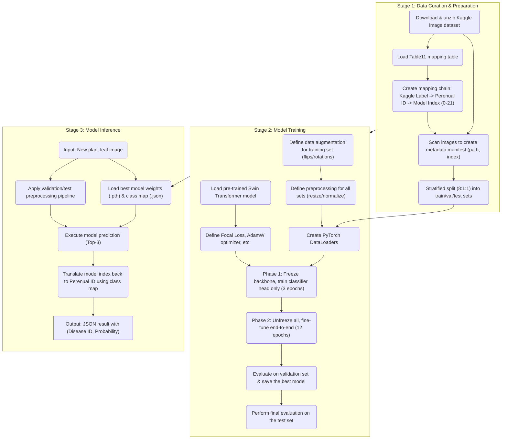

### Plant Disease Recognition Model Based on Swin Transformer

#### 1. Function Overview

* **Goal:** This function aims to build an end-to-end deep learning pipeline for accurately identifying plant diseases from leaf images. The entire process covers label mapping from heterogeneous data sources, model training using cutting-edge techniques, and the final generation of a standalone inference script for real-world predictions.
* **Implementation Approach:**
    * An advanced **Swin Transformer** vision model is used as the backbone network. This model has been pre-trained on the large-scale ImageNet dataset, equipping it with powerful general-purpose image feature extraction capabilities.
    * The training process employs a **two-stage transfer learning strategy**, combined with **Mixup/CutMix** data augmentation techniques to enhance the model's generalization ability.
    * To address the common issue of class imbalance in the dataset, **Focal Loss** is used as the loss function, enabling the model to focus more on learning hard-to-classify samples.

---

#### 2. Prerequisites & Environment

* **Libraries:**
    * Data Processing: `pandas`, `numpy`, `scikit-learn`
    * Deep Learning Framework: `torch`, `torchvision`
    * Models & Augmentation: `timm` (PyTorch Image Models)
    * Image Processing: `Pillow (PIL)`
    * Data Download: `kaggle`
* **Hardware Requirements:**
    * Model training requires a GPU with high VRAM (this project was completed on a Google Colab A100 GPU).
    * Model inference can be executed on either a CPU or a GPU.
* **Data Dependencies:**
    * **Kaggle API Credentials**: Used to automatically download the dataset from the Kaggle platform.
    * **Kaggle Plant Diseases Dataset**: Sourced from `faysal05/plant-diseases-dataset`, containing approximately 80,000 images.
    * **Manual Mapping Table**: `Table11_PlantDiseaseLinkTable.csv`, which defines the correspondence between Kaggle labels and the project's internal disease IDs.

---

#### 3. Data Source & Input

* **Source 1: Image Dataset**
    * **Source**: [Kaggle Plant Diseases Dataset](https://www.kaggle.com/datasets/faysal05/plant-diseases-dataset).
    * **Description**: A large dataset containing over 80,000 images of plant leaves, covering 84 unique "plant-disease" combination labels (e.g., `Apple___scab`).

* **Source 2: Label Mapping Table**
    * **Source**: `Table11_PlantDiseaseLinkTable.csv` (manually created).
    * **Description**: This is the "Rosetta Stone" connecting two independent data systems. Based on strategies like direct matching and symptom similarity, it accurately maps the 84 descriptive string labels from the Kaggle dataset to 22 unique Perenual plant disease IDs used internally by the project (an integer ID, where ID 0 represents "healthy").
    * **Label Mapping in Detail:**
        * **Background**
            This mapping table is designed to map the labels from the Kaggle Plant Disease Image Dataset (19GB) to the disease IDs in the Perenual plant disease database (Table 11). The Kaggle dataset contains images of various plants in both healthy and diseased states, with labels formatted as `<Plant_Name>__<Disease_Name>`. The Perenual database provides a more standardized plant disease classification system.
        * **Dataset Characteristics**
            - **Kaggle Dataset**: Contains 84 unique plant-disease combination labels.
            - **Perenual Database**: Contains 100 plant disease IDs (IDs 1-100).
            - **Key Challenge**: The classification granularity of the two systems differs; Kaggle labels are more specific (plant-specific), while Perenual IDs are more generic.
        * **Mapping Strategy**
            We employ a hierarchical mapping method to ensure maximum compatibility:
            1. **Direct Match** (Highest Priority)
               - Map directly when the disease name in the Kaggle label exactly matches Perenual's `common_name`.
               - Example: `Apple__scab` → ID 22 (Apple scab).
            2. **Disease Name Match** (Second Priority)
               - When there is a partial match of the disease name, select the most relevant Perenual ID.
               - Prioritize plant-specific IDs (e.g., map cherry powdery mildew to ID 98 instead of ID 5).
               - Example: `Cherry__powdery_mildew` → ID 98.
            3. **Symptom Similarity Match**
               - For diseases with no direct match, map based on symptom similarity.
               - Example: `Grape__black_rot` → ID 31 (Botrytis rot).
            4. **Pest Handling**
               - Map pest-related labels to the disease symptoms they cause.
               - Example: `Chili__whitefly` → ID 52 (Mosaic viruses).
            5. **Generic Disease Handling**
               - Labels with unspecified diseases (`__diseased`) are mapped to common diseases based on the plant type.
               - Example: `Cucumber__diseased` → ID 75 (Downy mildew).
            6. **Healthy Plants**
               - All healthy plants are uniformly mapped to ID 0.
               - Example: `Apple__healthy` → ID 0.
        * **Mapping Statistics**
            | Metric | Value |
            |:---|:---|
            | Unique Perenual ID Count | 22 |
            | Total Mappings | 91 |
            | Healthy Plant Mappings | 24 |
            | Disease Mappings | 67 |
            | Most Frequent ID | 38 (Leaf spot diseases, 7 times) |
            | Most Frequent Disease Category| Leaf diseases (IDs 6, 38, 61, etc.) |

---

#### 4. Workflow

The entire workflow consists of three core stages: data curation and preparation, model training, and finally, model inference and application.

---

* **4.1. Stage 1: Data Curation & Preparation**
    * **Step 1: Download Data**: Configure Kaggle API credentials in the Google Colab environment to automatically download and unzip the large dataset of over 80,000 images.
    * **Step 2: Label Mapping**: Load the core `Table11` mapping table. Based on this table, establish a complete mapping chain: first, map the string labels from Kaggle (e.g., `Apple___scab`) to Perenual's business IDs (e.g., `22`). Then, to meet the requirements of the PyTorch model, map these 22 discrete business IDs to a zero-based, contiguous index (`0, 1, 2, ..., 21`). Simultaneously, create a reverse mapping dictionary (`idx_to_label`) to translate the model's output back to the business ID during inference.
    * **Step 3: Create Metadata Manifest**: Iterate through all image folders without moving any physical files. Instead, create a Pandas DataFrame with two columns (`image_path`, `label_index`). This manifest serves as the central hub for all subsequent data operations.
    * **Step 4: Dataset Splitting**: Use the `train_test_split` function from `scikit-learn` to perform a **stratified split** on the metadata manifest, partitioning it into training, validation, and test sets at an **8:1:1** ratio. This ensures that the proportion of each disease class in each subset remains consistent with the original dataset.

* **4.2. Stage 2: Model Training**
    * **Step 2.1: Data Loading Strategy: Exploration & Final Implementation**:
        * **Strategy A (Theoretically Optimal but Failed in Practice)**: The initial idea was to maximize training speed by loading all ~80,000 processed image tensors, amounting to a massive 48GB, into the A100 GPU's VRAM at once.
        * **Practical Outcome**: As expected, this strategy failed during execution by triggering a `CUDA Out of Memory` error, exceeding the GPU's VRAM limit. This experiment provides valuable proof that for large datasets, a one-time full load is not feasible, even with top-tier GPUs.
        * **Strategy B (The Final Solution)**: The final implementation uses the standard PyTorch `Dataset` and `DataLoader` approach. This method loads only a small portion of data (a "batch") into VRAM for each training step. This not only solves the VRAM bottleneck but also allows for multi-process pre-loading via the `num_workers` parameter, ensuring that the CPU has the next batch ready while the GPU is computing, thus achieving the most efficient training pipeline.
    * **Step 2.2: Define Data Transforms and Loaders**: Define an image transformation pipeline for the training set that includes **random data augmentation** (e.g., random horizontal/vertical flips, random rotation, color jitter) to improve model robustness. Define a separate, simpler pipeline for the validation and test sets that only includes resizing and normalization. Based on these, create PyTorch `DataLoader` instances for each of the three datasets.
    * **Step 2.3: Configure Training Components**: Load a pre-trained Swin Transformer (`swin_base_patch4_window7_224`) model from the `timm` library. Define the `FocalLoss` function, the `AdamW` optimizer, and the `CosineAnnealingLR` learning rate scheduler.
    * **Step 2.4: Execute Two-Stage Training**:
        * **Phase 1 (Freeze Training)**: Freeze the parameters of the Swin Transformer's backbone network and train only the final fully-connected classification head. A higher learning rate (`1e-3`) is used for **3 epochs** to quickly adapt the model to the new classification task.
        * **Phase 2 (Fine-Tuning)**: Unfreeze all network layers and fine-tune the entire model end-to-end with a lower learning rate (`5e-5`) for a total of **12 epochs**. During this phase, **Mixup/CutMix** augmentation is applied to each batch in the training loop to further prevent overfitting.
    * **Step 2.5: Model Evaluation and Saving**: After each epoch, evaluate the model's performance (loss and accuracy) on the **validation set**. If the current model's validation loss is better than all previous epochs, save the current model weights as the best model (`_best.pth`). After all training is complete, load this best model and perform a final, unbiased performance evaluation on the **test set**.

* **4.3. Stage 3: Model Inference**
    * **Step 1: Prepare Inference Environment**: The inference script first loads the two core files produced during the training stage: the best model weights (`.pth` file) and the class mapping dictionary (`class_map.json`).
    * **Step 2: Image Preprocessing**: When a new image is to be tested, the script applies the **exact same** preprocessing pipeline as used for the validation set during training (resize to 224x224 and normalize).
    * **Step 3: Execute Prediction**: The preprocessed image tensor is fed into the loaded model, which has been switched to evaluation mode (`model.eval()`), to obtain the output logits. The Softmax function is then applied to convert these logits into a probability distribution.
    * **Step 4: Parse and Output Results**: The top-3 predictions with the highest probabilities are identified. Using the loaded mapping dictionary, the model's internal indices (e.g., `8`) are "translated" back into the business-relevant Perenual disease IDs (e.g., `22`). Finally, a list containing the predicted disease IDs and their corresponding confidences is output.

---

#### 5. Model & Results Interpretation

* **Training Strategy Rationale**
    * **Swin Transformer**: This model was chosen because it is one of the state-of-the-art (SOTA) models in the field of visual recognition. Its unique windowed self-attention mechanism can efficiently capture both local and global features in an image, making it highly suitable for complex texture recognition tasks like plant disease identification.
    * **Two-Stage Training**: This "freeze-then-fine-tune" strategy is a best practice in transfer learning. The first stage quickly adapts the model's output space to the new task, preventing the pre-trained weights from being corrupted by unstable gradients early on. The second stage of end-to-end fine-tuning further optimizes the entire network's feature extraction capabilities for the specific domain of "identifying plant diseases," thereby achieving higher accuracy.
    * **Focal Loss & Mixup/CutMix**: **Focal Loss** forces the model to focus more on learning from less frequent or difficult-to-distinguish disease classes by down-weighting easy-to-classify samples. **Mixup/CutMix** is a highly effective regularization technique that improves model generalization by training on mixed combinations of images and their labels, forcing the model to learn linear relationships between features.

* **Analysis of Training Results**
    * The model was trained for a total of 15 epochs (3 freeze + 12 fine-tune).
    * The training logs show that the model made a significant performance leap during the fine-tuning phase: the validation loss dropped sharply from `0.2913` at the end of the freeze phase to a final best of **`0.0384`**; the validation accuracy also climbed from about `84.9%` to over **`98%`**.
    * **Final Performance**: The best-saved model achieved a **final test accuracy of 98.33%** on the independent test set. This result indicates that the model not only performs exceptionally on the training and validation sets but also possesses strong generalization ability to accurately identify new, unseen images.

* **Interpretation of Learning Curves**
    * Observing the learning curve plots, both training and validation losses show a smooth and consistent downward trend, while accuracy steadily increases, with both converging to a very desirable level. The validation loss curve closely tracks the training loss curve without significant divergence, which strongly proves that the **model did not overfit**, and that the data augmentation and regularization strategies we employed were successful.
    

---

#### 6. Output

* **Training Artifacts:**
    * `swin_base_patch4_window7_224.ms_in1k_best.pth`: The best model weights file containing all model parameters, which is the core output of the training process.
    * `class_map.json`: The class mapping dictionary. It serves as the bridge connecting the model to business logic by translating the model's internal output indices (0-21) back to the project-defined Perenual disease IDs.
* **Inference Artifacts:**
    * For any given input leaf image, the inference script outputs a list of the top-3 prediction results, with each element containing two key pieces of information: `predicted_id` (the predicted Perenual disease ID) and `probability` (the confidence of that prediction).

---

#### 7. Notes & Future Improvements

* **Notes**:
    * The manually created `Table11` label mapping table is the cornerstone of the entire project. Its accuracy and rationale directly determine the performance ceiling of the model.
    * The current model is a "closed-set" classifier, meaning it can only predict from within the 22 categories it was trained on. For an image that does not belong to any of these 22 classes, it will still forcibly output the most similar prediction.
* **Future Improvements**:
    * **Handling Unknown Categories (Out-of-Distribution)**: Introduce a mechanism to identify an "unknown/uncertain" class. For example, a probability threshold (e.g., 80%) could be set. If the highest prediction probability falls below this threshold, the result could be flagged as "uncertain" instead of providing an incorrect, low-confidence prediction.
    * **Model Quantization/Optimization**: To deploy the model on mobile or edge devices, techniques like model quantization (e.g., to INT8) or pruning could be used to significantly reduce the model's size and speed up inference, with a slight trade-off in accuracy.
    * **Model Explainability (XAI)**: Integrate explainable AI techniques like Grad-CAM. For each prediction, this would not only provide the result but also generate a "heatmap" highlighting the regions of the image that contributed most to the model's decision (i.e., where the model is "looking"). This would greatly increase user trust in the model's results and help developers debug and analyze incorrect classifications.