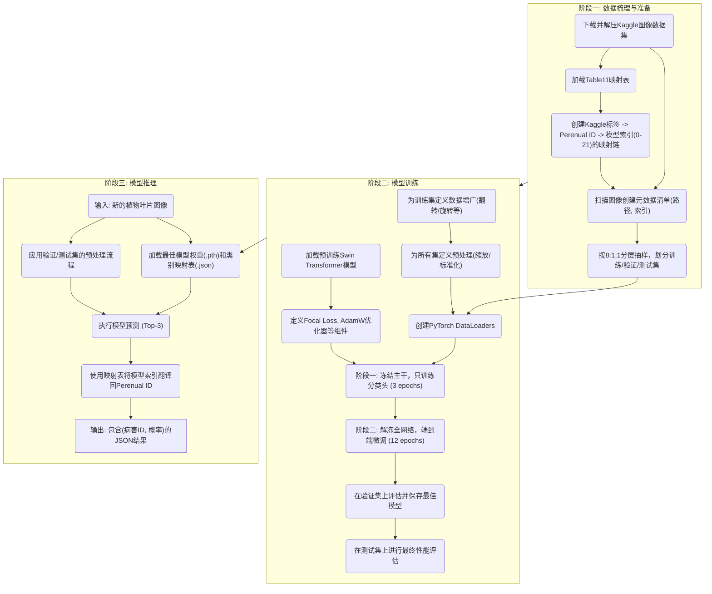
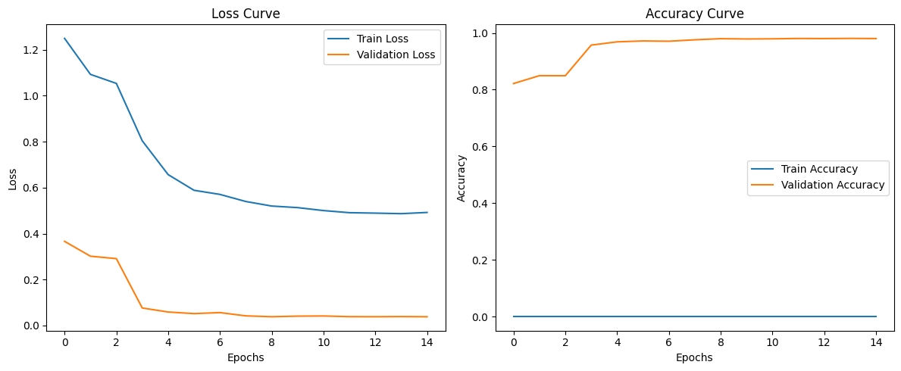

### 基于Swin Transformer的植物病害识别模型

#### 1. 功能概述 (Function Overview)

* **目标 (Goal):** 本功能旨在构建一个端到端的深度学习管道，用于通过叶片图像准确识别植物病害。整个流程覆盖了从异构数据源的标签映射、使用前沿技术的模型训练，到最终生成可用于实际预测的独立推理脚本的全过程。
* **实现思路 (Implementation Approach):**
    * 采用先进的**Swin Transformer**视觉模型作为骨干网络。该模型在大型ImageNet数据集上进行了预训练，使其具备了强大的通用图像特征提取能力。
    * 训练过程采用**两阶段迁移学习策略**，并结合**Mixup/CutMix**数据增广技术以提升模型的泛化能力。
    * 针对数据集中普遍存在的类别不平衡问题，使用**Focal Loss**作为损失函数，使模型能更专注于学习难分类的样本。

---

#### 2. 前置条件与环境依赖 (Prerequisites & Environment)

* **依赖库 (Libraries):**
    * 数据处理: `pandas`, `numpy`, `scikit-learn`
    * 深度学习框架: `torch`, `torchvision`
    * 模型与增广: `timm` (PyTorch Image Models)
    * 图像处理: `Pillow (PIL)`
    * 数据下载: `kaggle`
* **硬件要求 (Hardware):**
    * 模型训练需要配备高显存的GPU（本项目在Google Colab的A100 GPU上完成）。
    * 模型推理可在CPU或GPU上执行。
* **数据依赖 (Data Dependencies):**
    * **Kaggle API凭据**: 用于从Kaggle平台自动下载数据集。
    * **Kaggle植物病害数据集**: 来源于 `faysal05/plant-diseases-dataset`，包含约8万张图片。
    * **手动映射表**: `Table11_PlantDiseaseLinkTable.csv`，定义了Kaggle标签与项目内部疾病ID的对应关系。

---

#### 3. 数据源与输入 (Data Source & Input)

* **源1: 图像数据集 (Image Dataset)**
    * **来源**: [Kaggle Plant Diseases Dataset](https://www.kaggle.com/datasets/faysal05/plant-diseases-dataset)。
    * **描述**: 一个包含超过8万张植物叶片图像的大型数据集，覆盖了84种独特的“植物-病害”组合标签（例如`Apple___scab`）。

* **源2: 标签映射表 (Label Mapping Table)**
    * **来源**: `Table11_PlantDiseaseLinkTable.csv` (手动创建)。
    * **描述**: 这是连接两个独立数据系统的“罗塞塔石碑”。它根据直接匹配、症状相似性等策略，将Kaggle数据集中84个描述性的字符串标签，精准地映射到项目内部使用的22个唯一的Perenual植物病害ID（一个整数ID，其中ID 0代表“健康”）。
    * **标签映射详解 (Label Mapping in Detail):**
        * **背景**
            本映射表旨在将Kaggle植物疾病图像数据集（19GB）中的标签映射到Perenual植物疾病数据库（Table 11）中的疾病ID。Kaggle数据集包含多种植物的健康状态和疾病状态图像，标签格式为`<植物名称>__<疾病名称>`。Perenual数据库则提供了更规范的植物疾病分类体系。
        * **数据集特点**
            - **Kaggle数据集**：包含84个独特的植物-疾病组合标签
            - **Perenual数据库**：包含100个植物疾病ID（ID 1-100）
            - **关键挑战**：两个系统的疾病分类粒度不同，Kaggle标签更具体（植物特定），而Perenual ID更通用
        * **映射策略**
            我们采用分层映射方法确保最大兼容性：
            1. **直接匹配**（优先）
               - 当Kaggle标签中的疾病名称与Perenual的`common_name`完全匹配时直接映射
               - 示例：`Apple__scab` → ID 22 (Apple scab)
            2. **疾病名称匹配**（次优先）
               - 当疾病名称部分匹配时，选择最相关的Perenual ID
               - 优先选择植物特定的ID（如樱桃白粉病映射到ID 98而非ID 5）
               - 示例：`Cherry__powdery_mildew` → ID 98
            3. **症状相似性匹配**
               - 对于无直接匹配的疾病，基于症状相似性映射
               - 示例：`Grape__black_rot` → ID 31 (Botrytis rot)
            4. **虫害处理**
               - 虫害相关标签映射到其引起的疾病症状
               - 示例：`Chili__whitefly` → ID 52 (病毒病)
            5. **通用疾病处理**
               - 未指明具体疾病的标签(`__diseased`)根据植物类型映射到常见疾病
               - 示例：`Cucumber__diseased` → ID 75 (霜霉病)
            6. **健康植物**
               - 所有健康植物统一映射到ID 0
               - 示例：`Apple__healthy` → ID 0
        * **映射统计结果**
            | 指标 | 值 |
            |:---|:---|
            | 唯一Perenual ID数量 | 22 |
            | 总映射数量 | 91 |
            | 健康植物映射数 | 24 |
            | 疾病映射数 | 67 |
            | 最常用ID | 38 (叶斑病, 7次) |
            | 最常用疾病类别 | 叶部病害 (ID 6,38,61等) |

---

#### 4. 工作流程 (Workflow)

整个工作流由三个核心阶段构成：数据梳理与准备、模型训练、以及最终的模型推理应用。

---

* **4.1. 阶段一：数据梳理与准备 (Data Curation & Preparation)**
    * **步骤1: 下载数据**: 在Google Colab环境中，配置Kaggle API凭据，自动下载并解压包含8万多张图片的庞大数据集。
    * **步骤2: 标签映射**: 加载核心的`Table11`映射表。基于此表，建立一个完整的映射链：首先将Kaggle的字符串标签（如`Apple___scab`）映射到Perenual的业务ID（如`22`），然后为了适应PyTorch模型的需求，将这22个离散的业务ID再次映射到一个从0开始的连续索引（`0, 1, 2, ..., 21`）。同时，创建一个反向映射字典（`idx_to_label`），用于在推理时将模型的输出翻译回业务ID。
    * **步骤3: 创建元数据清单**: 遍历所有图像文件夹，但不移动任何物理文件。而是创建一个包含两列（`image_path`, `label_index`）的Pandas DataFrame。这个清单是后续所有数据操作的中央枢纽。
    * **步骤4: 数据集划分**: 使用`scikit-learn`的`train_test_split`函数，对元数据清单进行**分层抽样**，以**8:1:1**的比例将其划分为训练集、验证集和测试集，确保每个数据子集中各个病害类别的比例与原始数据集保持一致。

* **4.2. 阶段二：模型训练 (Model Training)**
    * **步骤2.1: 数据加载策略探索与最终实现**:
        * **策略A (理论最优但实践失败)**: 最初的设想是，为了最大化训练速度，将全部约8万张、处理后高达48GB的图像张量一次性加载到A100 GPU的显存中。
        * **实践结果**: 如预期，该策略在执行时因超出了GPU显存上限而触发`CUDA Out of Memory`错误。这个实验宝贵地证明了，对于大型数据集，一次性加载是不可行的，即便在使用顶级GPU的情况下。
        * **策略B (最终方案)**: 最终采用PyTorch标准的`Dataset`和`DataLoader`方案。该方案以“批处理(batch)”的方式，在每个训练步骤中只加载一小部分数据到显存中。这不仅解决了显存瓶颈，还可通过`num_workers`参数启用多进程预加载，确保GPU在计算时，CPU已经将下一个批次的数据准备就绪，从而实现最高效的训练流程。
    * **步骤2.2: 定义数据转换与加载器**: 为训练集定义一套包含**随机数据增广**（如随机水平/垂直翻转、随机旋转、颜色抖动）的图像转换流程，以提高模型的鲁棒性。为验证集和测试集定义另一套仅包含尺寸缩放和标准化的转换流程。基于此，为三个数据集分别创建PyTorch `DataLoader`实例。
    * **步骤2.3: 配置训练组件**: 从`timm`库加载一个在ImageNet上预训练好的Swin Transformer (`swin_base_patch4_window7_224`)模型。定义`FocalLoss`损失函数、`AdamW`优化器和`CosineAnnealingLR`学习率调度器。
    * **步骤2.4: 执行两阶段训练**:
        * **阶段一 (冻结训练)**: 冻结Swin Transformer的主干网络参数，只训练最后的全连接分类头。使用较高的学习率（`1e-3`）训练**3个epoch**，目的是让模型快速适应新的分类任务。
        * **阶段二 (微调)**: 解冻所有网络层，使用一个更低的学习率（`5e-5`）对整个模型进行端到端的微调，共训练**12个epoch**。在此阶段，训练循环中的每个批次都会应用**Mixup/CutMix**增广，进一步防止过拟合。
    * **步骤2.5: 模型评估与保存**: 在每个epoch结束后，在**验证集**上评估模型性能（损失和准确率）。如果当前模型的验证损失优于之前所有epoch，则将当前模型权重保存为最佳模型 (`_best.pth`)。全部训练结束后，加载这个最佳模型，并在从未参与过训练的**测试集**上进行一次最终的、无偏的性能评估。

* **4.3. 阶段三：模型推理 (Model Inference)**
    * **步骤1: 准备推理环境**: 推理脚本首先加载训练阶段产出的两个核心文件：最佳模型权重 (`.pth`文件) 和类别映射字典 (`class_map.json`)。
    * **步骤2: 图像预处理**: 当接收到一张新的待测图片时，脚本会对其应用与训练时**验证集完全相同**的预处理流程（缩放至224x224并标准化）。
    * **步骤3: 执行预测**: 预处理后的图像张量被送入已加载并切换到评估模式(`model.eval()`)的模型中，得到输出logits。通过Softmax函数将logits转换为概率分布。
    * **步骤4: 结果解析与输出**: 获取概率最高的Top-3预测结果。利用加载的映射字典，将模型的内部索引（如`8`）“翻译”回业务上可用的Perenual病害ID（如`22`）。最终，输出一个包含预测病害ID和对应置信度的列表。

---

#### 5. 模型与结果解读 (Model & Results Interpretation)

* **训练策略解读 (Training Strategy Rationale)**
    * **Swin Transformer**: 选择此模型是因为它是当前视觉识别领域的SOTA（State-of-the-art）模型之一，其独特的窗口化自注意力机制能高效地捕捉图像的局部和全局特征，非常适合复杂的纹理识别任务，如植物病害。
    * **两阶段训练**: 这种“先冻结、后微调”的策略是迁移学习中的最佳实践。第一阶段快速让模型适应新任务的输出空间，避免了预训练权重在早期被不稳定的梯度破坏。第二阶段的端到端微调则让整个网络的特征提取能力向“识别植物病害”这个特定领域进一步优化，从而达到更高的精度。
    * **Focal Loss & Mixup/CutMix**: **Focal Loss**通过降低易分类样本的权重，迫使模型更专注于学习数据量少或难以区分的病害类别。**Mixup/CutMix**则通过在训练时混合多张图片及其标签，强迫模型学习特征之间的线性关系，是一种极其有效的正则化手段，能显著提升模型的泛化能力。

* **训练结果分析 (Analysis of Training Results)**
    * 模型总计训练了15个epoch（3个冻结训练 + 12个微调）。
    * 从训练日志可以看出，模型在微调阶段取得了显著的性能飞跃：验证集损失从冻结阶段结束时的`0.2913`迅速下降到最终的**`0.0384`**；验证集准确率也从约`84.9%`一路攀升至超过**`98%`**。
    * **最终性能**: 加载的最佳模型在独立的测试集上取得了**98.33%的最终测试准确率**。这一结果表明，模型不仅在训练和验证集上表现优异，而且具备了强大的泛化能力，能够准确识别从未见过的新图像。

* **学习曲线解读 (Interpretation of Learning Curves)**
    * 观察学习曲线图，训练损失和验证损失都呈现出平滑且持续下降的趋势，而准确率则稳步上升，最终二者都收敛到一个非常理想的水平。验证损失曲线与训练损失曲线紧密贴合，没有出现明显分离，这有力地证明了**模型没有发生过拟合**，我们采用的数据增广和正则化策略是成功的。
     

---

#### 6. 输出 (Output)

* **训练产物 (Training Artifacts):**
    * `swin_base_patch4_window7_224.ms_in1k_best.pth`: 包含模型所有参数的最佳权重文件，是模型的核心产物。
    * `class_map.json`: 类别映射字典。它将模型内部的输出索引（0-21）翻译回项目定义的Perenual病害ID，是连接模型与业务逻辑的桥梁。
* **推理产物 (Inference Artifacts):**
    * 对于任意一张输入的叶片图像，推理脚本会输出一个Top-3预测结果列表，每个元素包含两个关键信息：`predicted_id` (预测的Perenual病害ID) 和 `probability` (该预测的置信度)。

---

#### 7. 注意事项与未来优化 (Notes & Future Improvements)

* **注意事项**:
    * 手动制定的`Table11`标签映射表是整个项目的基石，其映射的准确性和合理性直接决定了模型性能的天花板。
    * 当前模型是一个“闭集”分类器，即它只能从训练过的22个类别中进行预测。对于不属于这22类的图像，它依然会强行给出一个最相似的预测。
* **未来优化**:
    * **处理未知类别 (Out-of-Distribution)**: 引入一个“未知/不确定”类别的判断机制。例如，可以设定一个概率阈值（如80%），如果最高预测概率低于此阈值，则将结果标记为“不确定”，而不是给出一个错误的、低置信度的预测。
    * **模型轻量化**: 为了将模型部署到移动端或边缘设备，可以使用模型量化（如INT8量化）或剪枝等技术，在略微牺牲精度的情况下，大幅减小模型体积，并提升推理速度。
    * **模型可解释性 (XAI)**: 集成Grad-CAM等可解释性AI技术。对于每一次预测，不仅给出结果，还能生成一张“热力图”，高亮显示出图像中对模型决策贡献最大的区域（即模型“正在看”哪里）。这能极大地增加用户对模型结果的信任度，并帮助开发者调试和分析模型的错误案例。