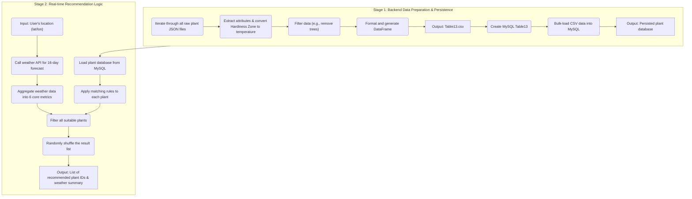

### Weather-Based Plant Recommendation Engine

Name: Zihan

---

#### 1. Function Overview

* **Goal:** This function aims to build an intelligent plant recommendation system. It comprises two core components: first, a backend data processing workflow that transforms, cleans, and consolidates scattered raw plant JSON data into a structured, queryable "plant attribute database"; second, a real-time recommendation logic that can filter and suggest the most suitable plants from the database based on the 16-day weather forecast for a user-specified geographic location.
* **Implementation Approach:**
    * This is a **Rule-Based Expert System**, not a machine learning model.
    * **Core Data Engineering**: A key step in this function is converting the abstract agricultural concept of a "Hardiness Zone" into a concrete, comparable metric: the "absolute minimum survival temperature (°C)".
    * **Core Matching Logic**: The "brain" of the recommendation engine is a series of preset conditional rules. It rigorously compares various metrics from the weather forecast (such as minimum temperature, sunshine duration, precipitation, etc.) against the survival requirements of each plant in the database to make a recommendation.

---

#### 2. Prerequisites & Environment

* **Libraries:**
    * Data Processing: `pandas`, `numpy`, `json`, `glob`
    * Data Acquisition: `requests`
    * Database: `mysql-connector-python`
    * Command-Line Tools: `argparse` (used in the `.py` script)
* **Data Dependencies:**
    * **Local Raw Data**: A large number of individual plant JSON files located in the `01_raw_data/01_species_details` directory.
    * **External API**: Open-Meteo Forecast API, used to retrieve 16-day weather forecasts.
    * **Database**: An accessible MySQL database for storing the processed core plant attributes table (`Table13_GeneralPlantListforRecommendation`).

---

#### 3. Data Source & Input

* **Source 1: Raw Plant Data**
    * **Source**: A collection of scattered `plant_species_details_*.json` files, with data sourced from the [Perenual Plant Open API](https://perenual.com/docs/plant-open-api).
    * **Data Dictionary (Key Fields)**:
        | Field Path | Type | Description |
        | :--- | :--- | :--- |
        | `id` | int | Unique ID of the plant |
        | `hardiness.min` | string | The lowest hardiness zone the plant can tolerate (e.g., "7") |
        | `type` | string | Plant type (e.g., "tree", "perennial") |
        | `sunlight` | list | Sunlight requirements (e.g., `["full sun", "part shade"]`) |
        | `watering` | string | Watering needs (e.g., "Average", "Minimal") |
        | `drought_tolerant`| boolean| Whether the plant is drought-tolerant |

* **Source 2: Real-time Weather Forecast**
    * **Source**: [Open-Meteo Forecast API](https://open-meteo.com/en/docs).
    * **Input**: `latitude`, `longitude`.
    * **Output (Key Daily Variables)**: `temperature_2m_min`, `sunshine_duration`, `uv_index_max`, `precipitation_sum`, `relative_humidity_2m_mean`, etc.

---

#### 4. Workflow

The workflow for this function is clearly divided into two stages: backend data preparation and persistence, and front-end real-time recommendation logic.

---

* **4.1. Stage 1: Backend Data Preparation & Persistence**
    * **Step 1: Data Extraction and Transformation**: Iterate through all JSON files in the `01_species_details` directory. For each file, extract the required plant attributes. **The most critical transformation** occurs here: using the predefined `HARDINESS_ZONE_TO_CELSIUS` dictionary, the plant's minimum hardiness zone (e.g., "7") is directly mapped to its absolute minimum survival temperature of `-17.8`°C. Concurrently, list data such as `sunlight` is converted into a JSON string for database storage.
    * **Step 2: Data Filtering and Formatting**: Consolidate all processed plant records into a single Pandas DataFrame. Then, perform filtering, for example, by removing all records where `plant_type` is 'tree', and organize the column order.
    * **Step 3: Data Storage (CSV & MySQL)**: First, save the cleaned and organized DataFrame as a CSV file (`Table13_GeneralPlantListforRecommendation.csv`) to serve as a backup and intermediate artifact. Subsequently, create the corresponding `Table13...` table in MySQL and use the `LOAD DATA LOCAL INFILE` command to efficiently bulk-load the data from the CSV into the database, completing the data persistence process.

* **4.2. Stage 2: Real-time Recommendation Logic**
    * **Step 1: Load Plant Data**: When the recommendation engine starts, it first loads the entire contents of `Table13` from the MySQL database into a Pandas DataFrame and performs pre-processing (such as parsing the `sunlight` JSON string back into a Python list and converting 0/1 values to booleans).
    * **Step 2: Fetch and Aggregate Weather Forecast**: Receive the latitude and longitude passed from the front end. Call the `get_and_aggregate_weather_data` function to request a 16-day daily weather forecast from the Open-Meteo API. This 16-day data is then aggregated into **6 core matching metrics**: `extreme_min_temp`, `extreme_max_temp`, `avg_sunshine_duration` (in hours), `avg_max_uv_index`, `avg_daily_precipitation`, and `avg_relative_humidity`.
    * **Step 3: Execute Matching and Filtering**: This is the "brain" of the engine. The `is_plant_suitable` function is called, iterating through **every row** in the plant DataFrame and determining if the plant is suitable for the upcoming 16-day weather conditions based on the four core matching rules detailed in the next section.
    * **Step 4: Process and Output Results**: Collect the IDs of all plants that pass the filter into a list. To enhance the diversity of the user experience, `random.shuffle()` is used to **randomly shuffle** this list. Finally, the aggregated weather information and the randomly sorted list of recommended plant IDs are returned as the result. The `.py` script version also supports outputting directly in a machine-readable JSON format via the `--json` command-line argument.

---

#### 5. Core Algorithm & Rule Interpretation

* **Algorithm 1: Hardiness Zone to Temperature Conversion**
    * This is the most central data engineering step in the project. The `HARDINESS_ZONE_TO_CELSIUS` dictionary is based on the official standard from the U.S. Department of Agriculture (USDA). It acts as a "translator," accurately converting a relatively abstract horticultural "zone" concept into a concrete, computable "temperature" threshold in physics. This step is the foundation upon which all subsequent temperature-related matching rules are built.

* **Algorithm 2: Recommendation Matching Rules**
    The `is_plant_suitable` function contains four cascading rules that form the logical core of the recommendation decision:
    1.  **Temperature Survival Rule:** This is the strictest hard-filter condition. The forecasted **extreme minimum temperature** (`extreme_min_temp`) over the next 16 days must be **greater than or equal to** the plant's **absolute minimum survival temperature** (`absolute_min_temp_c`) listed in the database. Any plant that does not meet this condition is immediately eliminated.
    2.  **Sunlight Matching Rule:** This rule considers both the **average sunshine duration** (`avg_sunshine_duration`) and the **average maximum UV index** (`avg_max_uv_index`).
        * **Duration**: `full sun` requires >= 6 hours; `part shade` requires 3-6 hours; `full shade` requires < 3 hours.
        * **Intensity**: Additional optimization logic is applied, such as excluding plants that only tolerate part shade from environments with a very high UV index (>8), or excluding full-sun plants from environments with a very low UV index (<3).
    3.  **Watering Matching Rule:** This rule matches the **average daily precipitation** (`avg_daily_precipitation`) with the plant's `watering` needs. For instance, a plant requiring `Frequent` watering would be eliminated if the forecast predicts low daily precipitation (< 3mm), while a plant needing `Minimal` watering would be eliminated if the forecast is too wet (> 5mm).
    4.  **Drought Tolerance Rule:** This is a supplementary rule. For a plant that is **not** drought-tolerant (`drought_tolerant` is False), if the **average relative humidity** (`avg_relative_humidity`) is below 40%, the air is considered too dry, and the plant is deemed unsuitable.

---

#### 6. Output

* **Intermediate Artifacts:**
    * `Table13_GeneralPlantListforRecommendation.csv`: The cleaned, transformed, and filtered plant attribute data file.
* **Final Artifacts:**
    * The `Table13_GeneralPlantListforRecommendation` table in the MySQL database, serving as the persisted data source for the recommendation engine.
    * For a single successful recommendation request, the final output is a JSON object or formatted text containing two parts:
        1.  **Aggregated Weather**: A summary of the 6 core metrics from the 16-day weather forecast.
        2.  **Recommended Plant IDs**: A randomly shuffled list of plant IDs that satisfy all matching rules.

---

#### 7. Notes & Future Improvements

* **Notes**:
    * The accuracy of the recommendation results is heavily dependent on the accuracy of the Open-Meteo 16-day weather forecast.
    * The `01_plant_recommendation.py` script is designed as a standalone service module that accepts input via command-line arguments and supports JSON output, making it easy to integrate with other programs (like a backend server).
* **Future Improvements**:
    * **Add More Matching Dimensions**: More weather variables (e.g., the impact of wind speed on fragile plants) or soil data could be introduced to make the matching rules more refined.
    * **Make Rules Configurable**: The current matching thresholds (e.g., "6 hours for full sun") are hard-coded. They could be designed as configurable parameters to adapt to different scenarios or for A/B testing.
    * **Introduce a Scoring System**: The current system is a binary "suitable/unsuitable" filter. A scoring system could be designed to rate all suitable plants based on how well they match, providing users with more personalized "highly recommended" vs. "moderately recommended" tiers.
    * **Incorporate Historical Climate Data**: In addition to the short-term forecast, local historical climate data could be incorporated to provide a longer-term assessment of climate suitability.