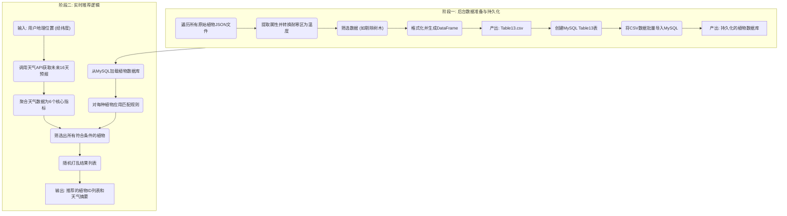

### 基于天气的植物推荐引擎

Name: Zihan

---

#### 1. 功能概述 (Function Overview)

* **目标 (Goal):** 本功能旨在构建一个智能植物推荐系统。它包含两个核心部分：第一，通过后台数据处理流程，将分散的原始植物JSON数据转换、清洗并整合成一个结构化的、可供查询的“植物属性数据库”；第二，提供一个实时的推荐逻辑，该逻辑能根据用户指定地理位置未来16天的天气预报，从数据库中筛选出最适宜种植的植物列表。
* **实现思路 (Implementation Approach):**
    * 这是一个基于**规则的专家系统 (Rule-Based Expert System)**，而非机器学习模型。
    * **核心数据工程**: 功能的关键一步是将农业领域的抽象概念“植物耐寒区 (Hardiness Zone)”转换为具体的、可与天气数据直接比较的“绝对最低生存温度 (°C)”。
    * **核心匹配逻辑**: 推荐引擎的“大脑”是一系列预设的条件规则，它严谨地将未来天气预报的各项指标（如最低温度、日照时长、降水量等）与植物资料库中每种植物的生存需求进行比对，从而做出推荐。

---

#### 2. 前置条件与环境依赖 (Prerequisites & Environment)

* **依赖库 (Libraries):**
    * 数据处理: `pandas`, `numpy`, `json`, `glob`
    * 数据获取: `requests`
    * 数据库: `mysql-connector-python`
    * 命令行工具: `argparse` (在`.py`脚本中使用)
* **数据依赖 (Data Dependencies):**
    * **本地原始数据**: 大量存放在 `01_raw_data/01_species_details` 目录下的单个植物JSON文件。
    * **外部API**: Open-Meteo 天气预报API (Forecast API)，用于获取未来16天的天气数据。
    * **数据库**: 一个可访问的MySQL数据库，用于存储处理好的植物属性核心表 (`Table13_GeneralPlantListforRecommendation`)。

---

#### 3. 数据源与输入 (Data Source & Input)

* **源1: 原始植物数据 (Raw Plant Data)**
    * **来源**: 分散的 `plant_species_details_*.json` 文件集合，数据源自 [Perenual Plant Open API](https://perenual.com/docs/plant-open-api)。
    * **数据字典 (关键字段)**:
        | 字段路径 | 类型 | 描述 |
        | :--- | :--- | :--- |
        | `id` | int | 植物的唯一ID |
        | `hardiness.min` | string | 植物能承受的最低耐寒区 (例如 "7") |
        | `type` | string | 植物类型 (例如 "tree", "perennial") |
        | `sunlight` | list | 日照需求 (例如 `["full sun", "part shade"]`) |
        | `watering` | string | 浇水需求 (例如 "Average", "Minimal") |
        | `drought_tolerant`| boolean| 是否抗旱 |

* **源2: 实时天气预报 (Real-time Weather Forecast)**
    * **来源**: [Open-Meteo Forecast API](https://open-meteo.com/en/docs)。
    * **输入**: `latitude` (纬度), `longitude` (经度)。
    * **输出 (关键日度变量)**: `temperature_2m_min`, `sunshine_duration`, `uv_index_max`, `precipitation_sum`, `relative_humidity_2m_mean` 等。

---

#### 4. 工作流程 (Workflow)

本功能的工作流清晰地分为两个阶段：后台的数据准备与入库，以及前台的实时推荐逻辑。

---

* **4.1. 阶段一：后台数据准备与持久化 (Backend Data Preparation & Persistence)**
    * **步骤1: 数据提取与转换**: 遍历 `01_species_details` 目录下的所有JSON文件。对每个文件，提取所需的植物属性。**最关键的转换**在此发生：利用预定义的 `HARDINESS_ZONE_TO_CELSIUS` 字典，将植物的最低耐寒区（如 "7"）直接映射为其能生存的绝对最低温度 `-17.8`°C。同时，将 `sunlight` 这样的列表数据转换为JSON字符串，以便存入数据库。
    * **步骤2: 数据筛选与格式化**: 将所有处理过的植物记录汇总到一个Pandas DataFrame中。然后进行筛选，例如，剔除所有 `plant_type` 为 'tree' 的记录，并整理列的顺序。
    * **步骤3: 数据存储 (CSV & MySQL)**: 将清洗、整理完毕的DataFrame首先保存为一个CSV文件 (`Table13_GeneralPlantListforRecommendation.csv`) 作为备份和中间产物。随后，在MySQL中创建对应的 `Table13...` 表，并使用 `LOAD DATA LOCAL INFILE` 命令将CSV中的数据高效、批量地导入数据库中，完成数据持久化。

* **4.2. 阶段二：实时推荐逻辑 (Real-time Recommendation Logic)**
    * **步骤1: 加载植物数据**: 推荐引擎启动时，首先从MySQL数据库中加载 `Table13` 的全部内容到Pandas DataFrame，并进行预处理（如将`sunlight` JSON字符串解析回Python列表，将0/1值转换为布尔值）。
    * **步骤2: 获取并聚合天气预报**: 接收前端传入的经纬度。调用 `get_and_aggregate_weather_data` 函数，向Open-Meteo API请求未来16天的逐日天气预报。然后，将这16天的数据聚合成**6个核心匹配指标**：`extreme_min_temp` (极端最低温), `extreme_max_temp` (极端最高温), `avg_sunshine_duration` (平均日照小时), `avg_max_uv_index` (平均最大紫外线指数), `avg_daily_precipitation` (日均降水), 和 `avg_relative_humidity` (平均相对湿度)。
    * **步骤3: 执行匹配与筛选**: 这是推荐引擎的“大脑”。调用 `is_plant_suitable` 函数，遍历植物DataFrame中的**每一行**，并根据下一节详述的四条核心匹配规则，判断该植物是否适合在未来16天的天气条件下生存。
    * **步骤4: 结果处理与输出**: 将所有通过筛选的植物ID收集到一个列表中。为了增加用户体验的多样性，使用 `random.shuffle()` 将该列表**随机打乱**。最终，将聚合后的天气信息和随机排序后的推荐植物ID列表作为结果输出。`.py` 脚本版本还支持通过命令行参数 `--json` 直接输出为程序友好的JSON格式。

---

#### 5. 核心算法与规则解读 (Core Algorithm & Rule Interpretation)

* **算法1: 耐寒区到温度的转换 (Hardiness Zone to Temperature Conversion)**
    * 这是本项目最核心的数据工程步骤。`HARDINESS_ZONE_TO_CELSIUS` 字典是基于美国农业部(USDA)的官方标准建立的。它扮演了一个“翻译器”的角色，将园艺学上一个相对抽象的“区域”概念，精准地“翻译”成了物理学上一个具体的、可计算的“温度”阈值。这一步是后续所有温度相关匹配规则得以实现的基础。

* **算法2: 推荐匹配规则 (Recommendation Matching Rules)**
    `is_plant_suitable` 函数内置了四条层层递进的规则，构成了推荐决策的逻辑核心：
    1.  **温度生存法则 (Temperature Survival Rule):** 这是最严格的硬性过滤条件。未来16天内预报的**极端最低温度** (`extreme_min_temp`) 必须**大于或等于**植物资料库中标注的**绝对最低生存温度** (`absolute_min_temp_c`)。任何不满足此条件的植物都会被直接淘汰。
    2.  **日照匹配法则 (Sunlight Matching Rule):** 综合考虑**平均日照时长** (`avg_sunshine_duration`) 和**平均最大紫外线指数** (`avg_max_uv_index`)。
        * **时长**: `full sun` (全日照) 需 >= 6小时；`part shade` (半阴) 需 3-6小时；`full shade` (全阴) 需 < 3小时。
        * **强度**: 额外优化判断，例如紫外线指数过高(>8)的环境不适合仅耐半阴的植物；指数过低(<3)的环境也满足不了全日照植物的需求。
    3.  **浇水匹配法则 (Watering Matching Rule):** 将**日均降水量** (`avg_daily_precipitation`) 与植物的浇水需求 (`watering`) 匹配。例如，`Frequent` (频繁浇水) 的植物在日均降水 < 3mm 的干旱预报下会被淘汰；而 `Minimal` (极少浇水) 的植物在日均降水 > 5mm 的湿润预报下也会被淘汰。
    4.  **抗旱性法则 (Drought Tolerance Rule):** 这是一个补充规则。对于**不抗旱** (`drought_tolerant` 为False) 的植物，如果**平均相对湿度** (`avg_relative_humidity`) 低于40%，则认为空气过于干燥，该植物不适宜种植。

---

#### 6. 输出 (Output)

* **中间产物 (Intermediate Artifacts):**
    * `Table13_GeneralPlantListforRecommendation.csv`: 清洗、转换并筛选后的植物属性数据文件。
* **最终产物 (Final Artifacts):**
    * MySQL数据库中的 `Table13_GeneralPlantListforRecommendation` 表，作为推荐引擎的持久化数据源。
    * 对于一次成功的推荐请求，最终输出一个包含两部分信息的JSON对象或格式化文本：
        1.  **聚合天气信息 (Aggregated Weather)**: 未来16天天气预报的6个核心指标总结。
        2.  **推荐植物ID列表 (Recommended Plant IDs)**: 一个经过随机排序的、符合所有匹配规则的植物ID列表。

---

#### 7. 注意事项与未来优化 (Notes & Future Improvements)

* **注意事项**:
    * 推荐结果的准确性强依赖于Open-Meteo未来16天天气预报的准确度。
    * `01_plant_recommendation.py` 脚本被设计为可独立运行的服务模块，通过命令行参数接收输入，并支持JSON格式输出，易于被其他程序（如后端服务器）集成和调用。
* **未来优化**:
    * **增加匹配维度**: 可以引入更多天气变量（如风速对脆弱植物的影响）或土壤数据来使匹配规则更精细。
    * **规则可配置化**: 当前的匹配阈值（如“6小时算全日照”）是硬编码的。未来可以将其设计为可配置的参数，以适应不同场景或进行A/B测试。
    * **引入评分系统**: 当前是“适合/不适合”的二元筛选。未来可以设计一个评分系统，对所有适合的植物根据其匹配程度进行打分和排序，为用户提供更人性化的“最推荐”、“较推荐”等分级建议。
    * **结合历史气候**: 除了短期天气预报，还可以结合当地的历史平均气候数据，为推荐提供更长期的气候适宜性判断。