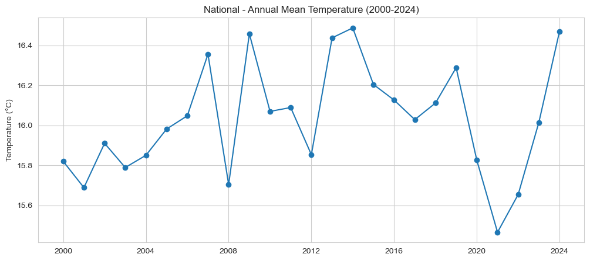
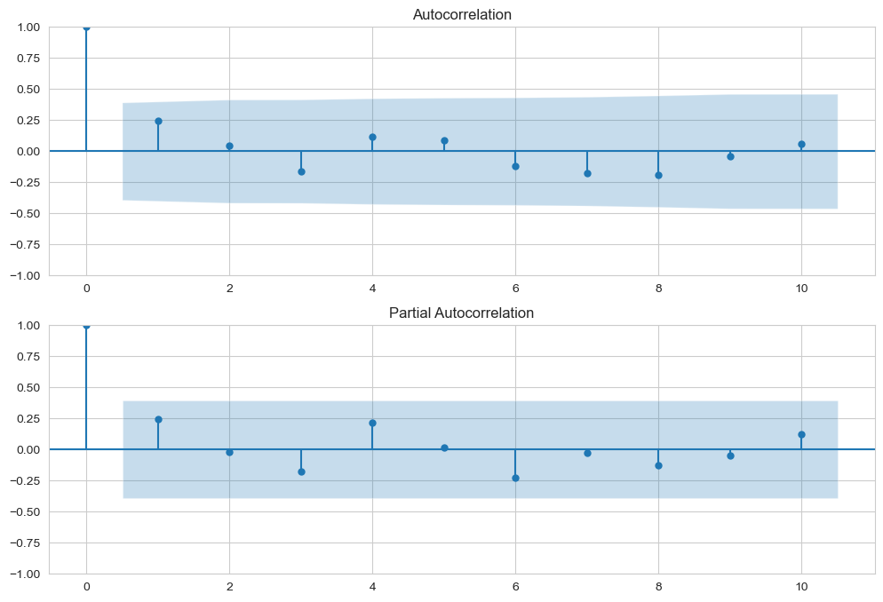
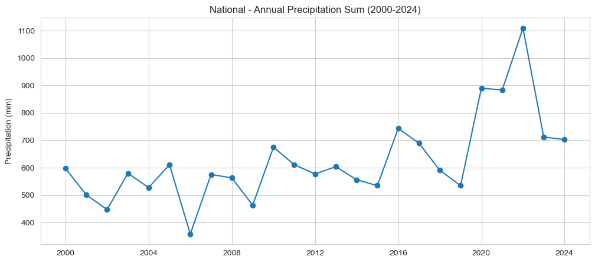
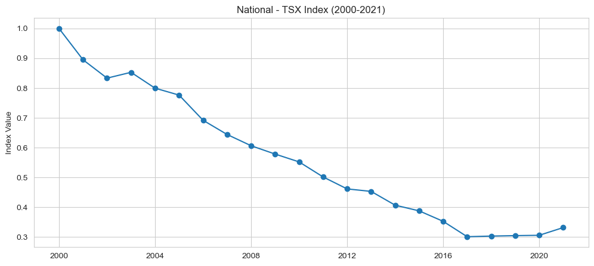
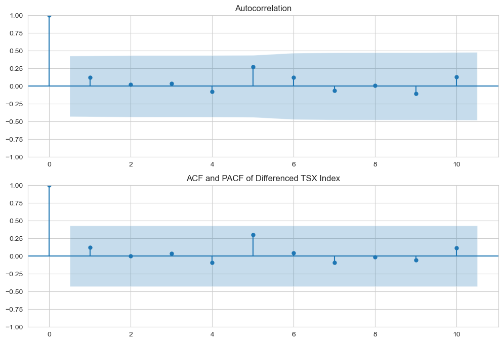

### Threatened Species Index (TSX) Prediction and API Service Workflow

Name: Zihan

---

#### 1. Function Overview

* **Goal:** This function aims to build an end-to-end data pipeline to forecast future trends of the Australian Threatened Species Index (TSX). It enhances the model's predictive power by incorporating historical weather data as exogenous variables and integrates the final historical and predicted data, serving it via a backend API to support front-end data visualizations like maps and charts.
* **Modeling Approach:**
    1.  **Weather Data Forecasting**: For three key weather indicators (annual mean temperature, annual total precipitation, and annual total shortwave radiation), independent **ARIMA** time series models are built to forecast their historical data (2000-2024) forward to 2027.
    2.  **TSX Index Forecasting**: A **SARIMAX** model with exogenous variables is established. It uses the historical TSX index (2000-2021) as the target variable and the complete historical and forecasted weather data (2000-2027) as exogenous variables to ultimately predict the TSX index values up to 2027.

---

#### 2. Prerequisites & Environment

* **Libraries:**
    * Data Processing: `pandas`, `numpy`, `os`
    * Data Acquisition: `openmeteo-requests`, `requests-cache`, `retry-requests`
    * Modeling & Analysis: `statsmodels`
    * Data Visualization: `matplotlib`, `seaborn`
    * Database: `mysql-connector-python`
    * Backend Service: `flask`, `flask-cors`
    * Geospatial Data Processing: `geopandas`, `shapely`
* **Data Dependencies:**
    * **Local Raw Data**: 6 CSV files containing historical TSX index data for Australia nationwide and 5 states/territories.
    * **External API**: Open-Meteo Historical Weather API for fetching historical weather data.
    * **Database**: An accessible MySQL database for storing the final results and geospatial shape data (`Table15_StateShapeTable`).

---

#### 3. Data Source & Input

* **Source 1: Raw TSX Index Data**
    * **Source**: 6 individual CSV files (`National.csv`, `Victoria.csv`, etc.).
    * **Data Dictionary**:
        | Column Name | Type  | Description                  |
        | :---------- | :---- | :--------------------------- |
        | `year`      | int   | Year (2000-2021)             |
        | `value`     | float | TSX index value for the year |
        | `low`       | float | Lower bound of the confidence interval |
        | `high`      | float | Upper bound of the confidence interval |

* **Source 2: Historical Weather Data**
    * **Source**: [Open-Meteo Archive API](https://open-meteo.com/en/docs/historical-weather-api).
    * **Data Dictionary (for fetched daily data)**:
        | Variable Name             | Description                         |
        | :------------------------ | :---------------------------------- |
        | `temperature_2m_mean`     | Daily mean air temperature (°C)     |
        | `precipitation_sum`       | Daily total precipitation (mm)      |
        | `shortwave_radiation_sum` | Daily total shortwave radiation (MJ/m²) |

---

#### 4. Workflow

The entire workflow can be divided into four main stages: data preparation, modeling and forecasting, data persistence, and API service.

* **4.1. Stage 1: Data Preparation & Enrichment**
    * **Step 1: Merge TSX Data**: Iteratively read the 6 CSV files, add a `state` column based on the filename, rename columns, and merge all data into a primary dataframe named `combined_df` (covering the years 2000-2021).
    * **Step 2: Fetch Weather Data**: Use the `openmeteo-requests` client (configured with caching and retries), based on the latitude and longitude of each state capital, to fetch **daily** weather data from 2000 to 2024.
    * **Step 3: Aggregate Weather Data**: Resample and aggregate the vast amount of daily data by year: calculate the **annual mean** for temperature, and the **annual sum** for precipitation and radiation, to generate the annual dataset `weather_df`. Simultaneously, calculate the `National` level indicators by averaging the data from all states.
    * **Step 4: Merge Final Dataset**: Use a **right merge (`how='right'`)** to combine `combined_df` and `weather_df`. This uses the weather data's timeline (2000-2024) as the base to ensure a complete time axis. The TSX-related columns for the years 2022-2024 will be automatically filled with `NaN`. The final output is `Table14_TSX_Table_VIC_version3.csv`.

* **4.2. Stage 2: Time Series Modeling & Prediction**
    * **Step 1: Forecast Weather Data (ARIMA)**:
        * **Objective**: Prepare exogenous variables covering the entire forecast period (up to 2027) for the SARIMAX model.
        * **Process**: For the three series—annual mean temperature, annual total precipitation, and annual total shortwave radiation—determine the `(p, d, q)` parameters through visualization and ACF/PACF plot analysis, build independent ARIMA models, and forecast values for 2025-2027.
    * **Step 2: Forecast TSX Index (SARIMAX)**:
        * **Objective**: Forecast the core metric, the TSX index.
        * **Process**:
            1.  Perform a stationarity test on the historical TSX index (2000-2021). A clear downward trend indicates it is a non-stationary series.
            2.  Apply first-order differencing (`d=1`) to make the series stationary.
            3.  Plot ACF/PACF for the differenced series to determine `p=1`, `q=0`. The final model order is `(1, 1, 0)`.
            4.  Train the `SARIMAX(1, 1, 0)` model using TSX index and weather data from 2000-2021.
            5.  Use the weather data from 2022-2027 (historical + forecasted) as exogenous variables to predict the TSX index for the next 6 years.
    * **Step 3: Generalization and Integration**:
        * Encapsulate the above modeling and forecasting process in a loop to generate predictions for all regions (national and all states).
        * Merge the historical and predicted data for all regions and add a `value_type` column (`'Historical'` or `'Predicted'`) for distinction. The final output is `Table14_TSX_Table_VIC_version4.csv`.

* **4.3. Stage 3: Data Persistence**
    * **Step 1: Create Table**: Execute the `CREATE TABLE IF NOT EXISTS Table14_TSX_Table_VIC ...` statement in the MySQL database to define the table structure.
    * **Step 2: Import Data**: To prevent duplicates, first execute `TRUNCATE TABLE` to clear the table. Then, use the `LOAD DATA LOCAL INFILE` command to efficiently bulk-load the contents of `version4.csv` into the database table.
    * **Step 3: Verification**: Ensure the data has been imported successfully by querying the total row count and previewing the first few rows.

* **4.4. Stage 4: Backend API Service**
    * **Step 1: Startup & Loading**: On startup, the Flask application connects to the MySQL database and loads `Table14` (TSX data) and `Table15` (geospatial shape data) into memory as a `pandas.DataFrame` and `geopandas.GeoDataFrame` respectively, to ensure fast responses.
    * **Step 2: API Endpoints**: Provides three core API endpoints:
        * `GET /api/map/geojson`: Returns the geographical boundary information for all states (in GeoJSON format) to draw the base map.
        * `GET /api/map/data/<int:year>`: Based on the provided year, returns the TSX index values for all regions for that year, used for map coloring (choropleth).
        * `GET /api/chart/data/<string:state>`: Based on the provided state name, returns the complete time series data for that state from 2000 to 2027 (including historical and predicted values) to draw a line chart.

---

#### 5. Model & Results Interpretation

* **5.1. Weather Forecasting Models (ARIMA)**
    * **Annual Mean Temperature (ARIMA(1,0,0))**:
        * **Basis for Selection**: Observing the ACF and PACF plots for the annual mean temperature series below. The ACF plot (top) shows a gradual decline (tailing-off), while the PACF plot (bottom) cuts off after lag 1 (dropping abruptly into the blue confidence interval). This is a typical characteristic of an AR(1) model, so we choose `p=1, d=0, q=0`.
        
        
        * **Results Interpretation**: The model summary shows that the diagnostic tests are good (`Prob(Q): 0.95`, `Prob(JB): 0.76`), indicating that the model residuals are random white noise and follow a normal distribution. Although the p-value for the `ar.L1` term (0.212) is not significant, the overall model is reliable and can be used to provide a conservative future forecast.
    * **Annual Total Precipitation (ARIMA(0,0,0))**:
        * **Basis for Selection**: As shown in the ACF/PACF plots below, almost all lags are within the confidence interval, indicating that the series is very close to white noise (a random series). Past values have almost no predictive power for the future. Therefore, the most suitable model is ARIMA(0,0,0).
        
        
        * **Results Interpretation**: The model **needs improvement**. The `Prob(Q)` is 0.01 (<0.05), indicating that there is still uncaptured autocorrelation in the model residuals. The current model's forecast is the historical mean, which can serve as a baseline, but there is room for optimization in the future.
    * **Annual Total Shortwave Radiation (ARIMA(0,0,0))**:
        * **Basis for Selection**: Similar to precipitation, the ACF/PACF plots for radiation also show very weak autocorrelation, approaching white noise. Therefore, we also choose a simple ARIMA(0,0,0) model.
        
        
        * **Results Interpretation**: The model **performs excellently**. The diagnostic test results are ideal (`Prob(Q): 0.22`, `Prob(JB): 0.55`), indicating that this is a very suitable model with reliable forecast results.

* **5.2. TSX Index Forecasting Model (SARIMAX(1,1,0))**
    * **Basis for Parameter Selection**:
        * `d=1`: Observing the time series plot of the original TSX index (2000-2021) below, a very clear long-term downward trend can be seen. This is a typical feature of a "non-stationary" series. For non-stationary series, differencing must be applied to eliminate the trend and make it stationary, so the model can learn its underlying patterns. Therefore, we choose to perform first-order differencing, i.e., d=1.
        
        * `p=1, q=0`: After performing first-order differencing on the TSX index, we observe its ACF/PACF plots. As shown below, the PACF plot (bottom) "cuts off" after lag 1 (dropping abruptly into the blue confidence interval), while the ACF plot (top) exhibits a "tailing-off" pattern (gradual decay). This combination of a "PACF cut-off and ACF tailing-off" is a textbook characteristic of an AR(1) process, so we determine `p=1, q=0`.
        
    * **Model Quality Assessment**:
        * **The model is very robust**. All diagnostic test results are ideal (`Prob(Q): 0.19`, `Prob(JB): 0.97`, `Prob(H): 0.25`). This strongly proves that the model's residuals are random and that the model has successfully extracted the patterns from the data.
    * **Key Findings**:
        * **The primary driver is historical inertia**: The P>|z| value for the `ar.L1` term is `0.000`, making it **highly statistically significant**. This indicates that the change in the TSX index is largely driven by its own change in the previous year, showing a strong "momentum effect."
        * **Weather impact is not significant**: The p-values for the three weather-related exogenous variables are all much greater than 0.05. This is an **important scientific finding**: on a national, annual macro-scale, the yearly fluctuations in weather indicators did **not** have a statistically significant direct impact on the annual changes in the TSX index. The index's long-term intrinsic trend is the more dominant factor.

---

#### 6. Output

* **Intermediate File**: `Table14_TSX_Table_VIC_version3.csv` - A cleaned dataset integrating historical TSX and historical weather data.
* **Final File**: `Table14_TSX_Table_VIC_version4.csv` - Contains complete historical and predicted data for all regions from 2000 to 2027.
* **Database**: The `Table14_TSX_Table_VIC` table in MySQL, storing the final complete data.
* **Service**: A continuously running Flask backend application providing data services through three API endpoints.

---

#### 7. Notes & Future Improvements

* **Notes**:
    * A `ConvergenceWarning` appeared during the fitting of the SARIMAX model. This is a common technical issue caused by a small sample size (only 22 data points). Given the excellent diagnostic test results of the model, this warning can be safely ignored.
* **Future Improvements**:
    * **Optimize the precipitation model**: The performance of the ARIMA(0,0,0) model for `annual_precip_sum` is not ideal. Future work could explore higher-order ARIMA models or consider seasonal components to improve the forecast.
    * **Explore more granular relationships**: This study found that weather is not a significant factor at the "annual-national" level. Future research could explore whether a stronger correlation exists between weather and the TSX index at a finer temporal (e.g., monthly) or spatial (e.g., smaller ecological regions) granularity.