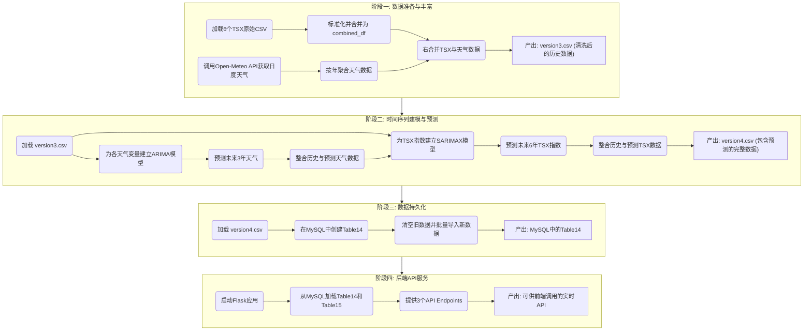
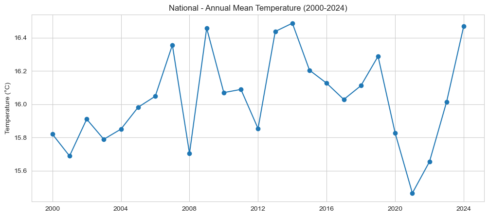
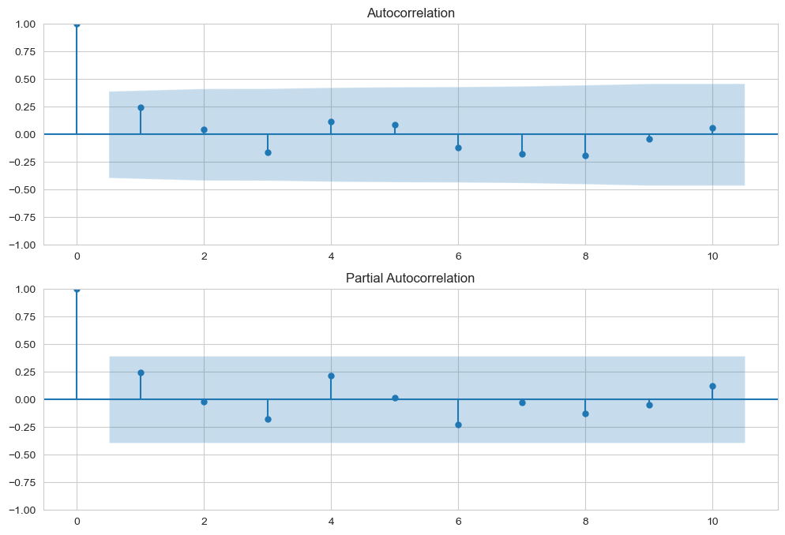
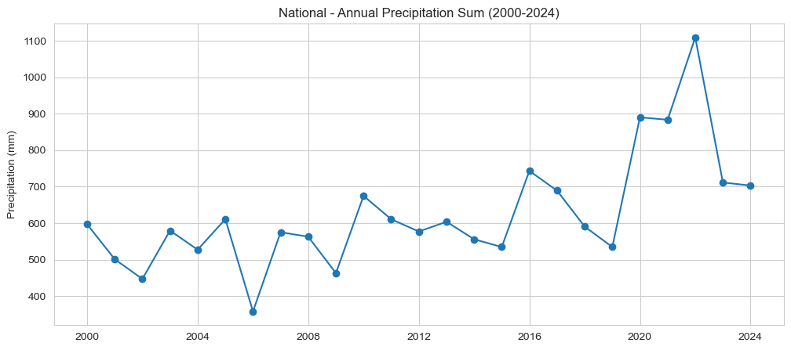
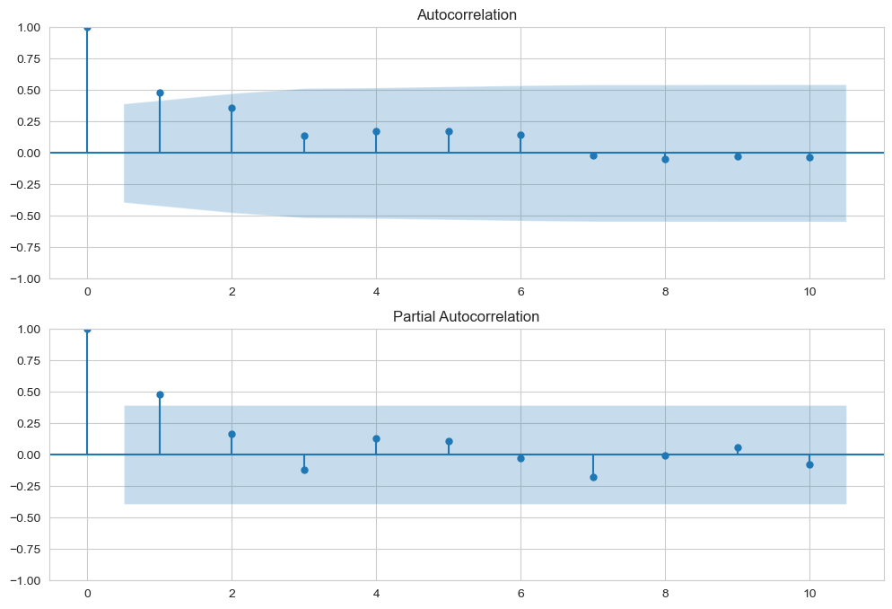
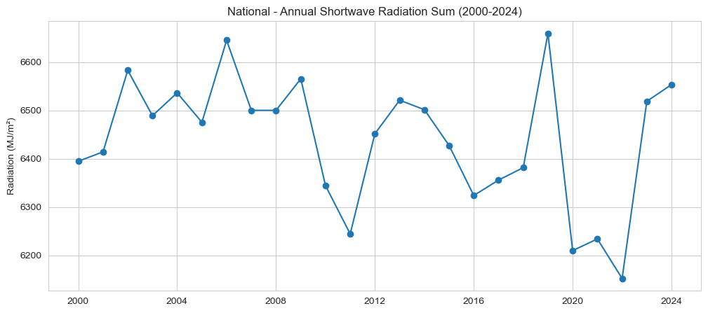
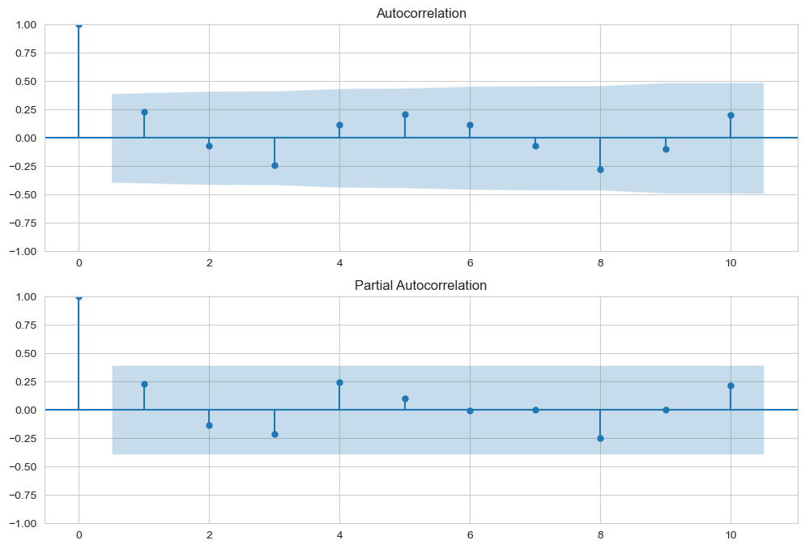
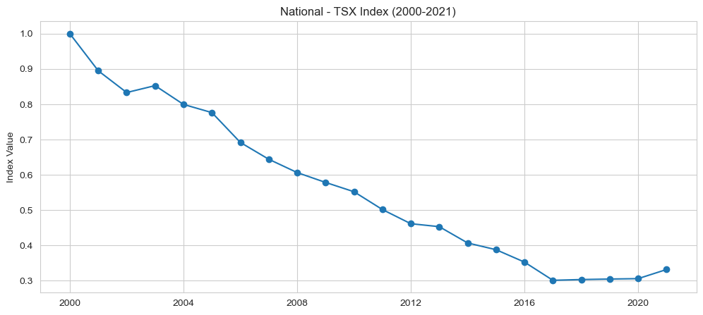
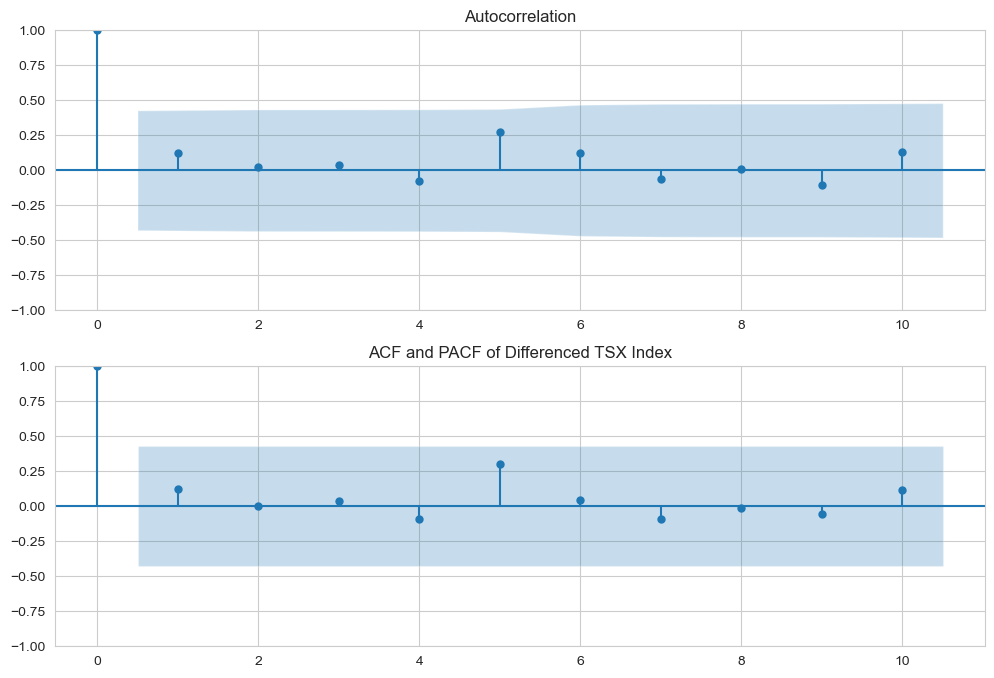

### 受威胁物种指数 (TSX) 的预测与API服务工作流

Name: Zihan

---

#### 1. 功能概述 (Function Overview)

* **目标 (Goal):** 本功能旨在构建一个端到端的数据管道，用于预测澳大利亚受威胁物种指数（Threatened Species Index, TSX）的未来趋势。它通过引入历史天气数据作为外生变量来增强模型的预测能力，并将最终的历史与预测数据整合，通过后端API提供服务，以支持前端的数据可视化（如地图和图表）。
* **建模思路 (Modeling Approach):**
    1.  **天气数据预测**: 对三个关键天气指标（年平均温度、年总降水量、年总短波辐射量），分别建立独立的 **ARIMA** 时间序列模型，将其历史数据（2000-2024）预测至2027年。
    2.  **TSX指数预测**: 建立带有外生变量的 **SARIMAX** 模型。使用历史TSX指数（2000-2021）作为目标变量，并使用完整的历史及预测天气数据（2000-2027）作为外生变量，最终预测出TSX指数至2027年的数值。

---

#### 2. 前置条件与环境依赖 (Prerequisites & Environment)

* **依赖库 (Libraries):**
    * 数据处理: `pandas`, `numpy`, `os`
    * 数据获取: `openmeteo-requests`, `requests-cache`, `retry-requests`
    * 建模与分析: `statsmodels`
    * 数据可视化: `matplotlib`, `seaborn`
    * 数据库: `mysql-connector-python`
    * 后端服务: `flask`, `flask-cors`
    * 地理数据处理: `geopandas`, `shapely`
* **数据依赖 (Data Dependencies):**
    * **本地原始数据**: 6个CSV文件，分别包含澳大利亚全国及5个州/领地的TSX指数历史数据。
    * **外部API**: Open-Meteo 历史天气API，用于获取历史天气数据。
    * **数据库**: 一个可访问的MySQL数据库，用于存储最终结果和地理形状数据 (`Table15_StateShapeTable`)。

---

#### 3. 数据源与输入 (Data Source & Input)

* **源1: TSX指数数据 (Raw TSX Index Data)**
    * **来源**: 6个独立的CSV文件 (`National.csv`, `Victoria.csv`, etc.)。
    * **数据字典**:
        | 列名 | 类型 | 描述 |
        | :--- | :--- | :--- |
        | `year` | int | 年份 (2000-2021) |
        | `value` | float | 当年的TSX指数值 |
        | `low` | float | 指数值的置信区间下限 |
        | `high` | float | 指数值的置信区间上限 |

* **源2: 历史天气数据 (Historical Weather Data)**
    * **来源**: [Open-Meteo Archive API](https://open-meteo.com/en/docs/historical-weather-api)。
    * **数据字典 (获取的日度数据)**:
        | 变量名 | 描述 |
        | :--- | :--- |
        | `temperature_2m_mean` | 日平均气温 (°C) |
        | `precipitation_sum` | 日总降水量 (mm) |
        | `shortwave_radiation_sum` | 日总短波辐射量 (MJ/m²) |

---

#### 4. 工作流程 (Workflow)

整个工作流可以分为四个主要阶段：数据准备、建模预测、数据持久化和API服务。

* **4.1. 阶段一：数据准备与丰富 (Data Preparation & Enrichment)**
    * **步骤1: 合并TSX数据**: 循环读取6个CSV文件，根据文件名添加`state`列，重命名列名，并将所有数据合并成一个名为 `combined_df` 的主数据集 (覆盖2000-2021年)。
    * **步骤2: 获取天气数据**: 使用 `openmeteo-requests` 客户端（已配置缓存和重试机制），以各州首府的经纬度为基准，获取2000-2024年的**日度**天气数据。
    * **步骤3: 聚合天气数据**: 将海量的日度数据按年份进行重采样和聚合：温度求**年平均值**，降水和辐射求**年总和**，生成年度数据集 `weather_df`。同时，通过对各州数据求平均，计算出 `National` 级别的指标。
    * **步骤4: 合并最终数据集**: 使用**右合并 (`how='right'`)** 将 `combined_df` 与 `weather_df` 合并。以天气数据（2000-2024）为基准，确保时间轴的完整性。2022-2024年的TSX指数相关列会自然填充为 `NaN`。最终产出 `Table14_TSX_Table_VIC_version3.csv`。

* **4.2. 阶段二：时间序列建模与预测 (Time Series Modeling & Prediction)**
    * **步骤1: 预测天气数据 (ARIMA)**:
        * **目标**: 为SARIMAX模型准备覆盖整个预测期（至2027年）的外生变量。
        * **流程**: 对年平均温度、年总降水量、年总短波辐射量这三个序列，分别通过可视化、ACF/PACF图分析来确定 `(p, d, q)` 参数，建立独立的ARIMA模型，并预测2025-2027年的数值。
    * **步骤2: 预测TSX指数 (SARIMAX)**:
        * **目标**: 预测核心指标TSX指数。
        * **流程**:
            1.  对历史TSX指数（2000-2021）进行平稳性检验。发现其有明显下降趋势，为非平稳序列。
            2.  进行一阶差分 (`d=1`) 使序列平稳。
            3.  对差分后的序列绘制ACF/PACF图，确定 `p=1`, `q=0`。最终模型阶数为 `(1, 1, 0)`。
            4.  使用2000-2021年的TSX指数和天气数据训练 `SARIMAX(1, 1, 0)` 模型。
            5.  使用2022-2027年的天气数据（历史+预测）作为外生变量，预测未来6年的TSX指数。
    * **步骤3: 泛化与整合**:
        * 将上述建模预测流程封装在一个循环中，为所有地区（全国及各州）生成预测结果。
        * 将所有地区的历史数据与预测数据合并，并添加 `value_type` 列（`'Historical'` 或 `'Predicted'`）以作区分。最终产出 `Table14_TSX_Table_VIC_version4.csv`。

* **4.3. 阶段三：数据持久化 (Data Persistence)**
    * **步骤1: 创建表**: 在MySQL数据库中执行 `CREATE TABLE IF NOT EXISTS Table14_TSX_Table_VIC ...` 语句，定义表结构。
    * **步骤2: 导入数据**: 为防止重复，先执行 `TRUNCATE TABLE` 清空表。然后使用 `LOAD DATA LOCAL INFILE` 命令，将 `version4.csv` 的内容高效地批量导入到数据库表中。
    * **步骤3: 验证**: 通过查询总行数和预览前几行数据，确保数据已成功导入。

* **4.4. 阶段四：后端API服务 (Backend API Service)**
    * **步骤1: 启动与加载**: Flask应用在启动时，会连接到MySQL数据库，一次性将 `Table14` (TSX数据) 和 `Table15` (地理形状数据) 加载到服务器内存的 `pandas.DataFrame` 和 `geopandas.GeoDataFrame` 中，以实现快速响应。
    * **步骤2: API端点**: 提供三个核心API接口：
        * `GET /api/map/geojson`: 返回所有州的地理边界信息（GeoJSON格式），用于绘制地图底图。
        * `GET /api/map/data/<int:year>`: 根据传入的年份，返回该年所有地区的TSX指数值，用于地图着色。
        * `GET /api/chart/data/<string:state>`: 根据传入的州名，返回该州从2000年到2027年的完整时间序列数据（包括历史和预测），用于绘制折线图。

---

#### 5. 模型与结果解读 (Model & Results Interpretation)

* **5.1. 天气预测模型 (ARIMA)**
    * **年平均温度 (ARIMA(1,0,0))**:
        * **选择依据**: 观察下方年平均温度序列的ACF与PACF图。ACF图（上）显示自相关性逐渐减弱（拖尾），而PACF图（下）在滞后1阶后“截尾”（突然落入蓝色置信区间）。这是AR(1)模型的典型特征，因此我们选择`p=1, d=0, q=0`。
        
        
        * **结果解读**: 模型摘要显示，诊断检验结果良好 (`Prob(Q): 0.95`, `Prob(JB): 0.76`)，表明模型残差是随机的白噪音且符合正态分布。尽管 `ar.L1` 项的P值(0.212)不显著，但模型整体是可靠的，可用于提供一个保守的未来预期。
    * **年总降水量 (ARIMA(0,0,0))**:
        * **选择依据**: 选择依据: 如下方ACF/PACF图所示，几乎所有的滞后阶数都在置信区间内，这表明该序列非常接近白噪音（随机序列），过去的数值对未来几乎没有预测能力。因此，最合适的模型是ARIMA(0,0,0)。
        
        
        * **结果解读**: 模型**有待改进**。`Prob(Q)` 为0.01 (<0.05)，说明模型残差中仍存在未被捕捉的自相关性。当前模型预测结果为历史均值，可作为基线，但未来有优化空间。
    * **年总短波辐射量 (ARIMA(0,0,0))**:
        * **选择依据**: 与降水量类似，辐射量的ACF/PACF图也显示出很弱的自相关性，接近白噪音。因此，我们同样选择一个简单的ARIMA(0,0,0)模型。
        
        
        * **结果解读**: 模型**表现出色**。诊断检验结果理想 (`Prob(Q): 0.22`, `Prob(JB): 0.55`)，表明这是一个非常合适的模型，预测结果可靠。

* **5.2. TSX指数预测模型 (SARIMAX(1,1,0))**
    * **参数选择依据**:
        * `d=1`: 观察下方原始TSX指数的时间序列图（2000-2021），可以发现非常明显的长期下降趋势。这是一个典型的“非平稳”序列特征。对于非平稳序列，必须进行差分操作来消除趋势，使其平稳化，以便模型能学习其内在规律。因此，我们选择进行一阶差分，即d=1。
        
        * `p=1, q=0`: 对TSX指数进行一阶差分后，我们观察其ACF/PACF图。如下图所示，PACF图（下）在滞后1阶之后“截尾”（突然落入蓝色置信区间），而ACF图（上）呈现出“拖尾”（逐渐衰减）的形态。这个“PACF截尾，ACF拖尾”的组合是AR(1)过程的教科书级特征，因此我们确定`p=1, q=0`。
        
    * **模型质量评估**:
        * **模型非常稳健**。所有诊断检验结果均非常理想 (`Prob(Q): 0.19`, `Prob(JB): 0.97`, `Prob(H): 0.25`)。这有力地证明了模型的残差是随机的，模型已成功提取了数据中的规律。
    * **关键发现**:
        * **主要驱动力是历史惯性**: `ar.L1` 项的 P>|z| 值为 `0.000`，是**高度统计显著的**。这说明TSX指数的变化很大程度上受到其自身前一年变化的影响，存在强大的“动量效应”。
        * **天气影响不显著**: 三个天气外生变量的P值均远大于0.05。这是一个**重要的科学发现**：在全国年度的宏观尺度上，天气指标的年度波动**并未**对TSX指数的年度变化产生统计上显著的直接影响。指数的长期内在趋势是更主导的因素。

---

#### 6. 输出 (Output)

* **中间文件**: `Table14_TSX_Table_VIC_version3.csv` - 整合了历史TSX和历史天气数据的清洗后数据集。
* **最终文件**: `Table14_TSX_Table_VIC_version4.csv` - 包含所有地区从2000到2027年的完整历史与预测数据。
* **数据库**: 在MySQL中的 `Table14_TSX_Table_VIC` 表，存储了最终的完整数据。
* **服务**: 一个持续运行的Flask后端应用，通过三个API端点提供数据服务。

---

#### 7. 注意事项与未来优化 (Notes & Future Improvements)

* **注意事项**:
    * SARIMAX模型在拟合时出现了 `ConvergenceWarning`。这是由于训练样本量较小（仅22个数据点）导致的常见技术问题。鉴于模型的诊断检验结果非常出色，此警告可以安全地忽略。
* **未来优化**:
    * **优化降水模型**: `annual_precip_sum` 的ARIMA(0,0,0)模型效果不佳，未来可以尝试更高阶的ARIMA模型或考虑季节性因素来改进预测。
    * **探索更细粒度的关系**: 本研究发现天气在“年度-全国”级别影响不显著。未来的研究可以探索在更细的时间粒度（如月度）或空间粒度（如更小的生态区域）上，天气与TSX指数之间是否存在更强的关联。